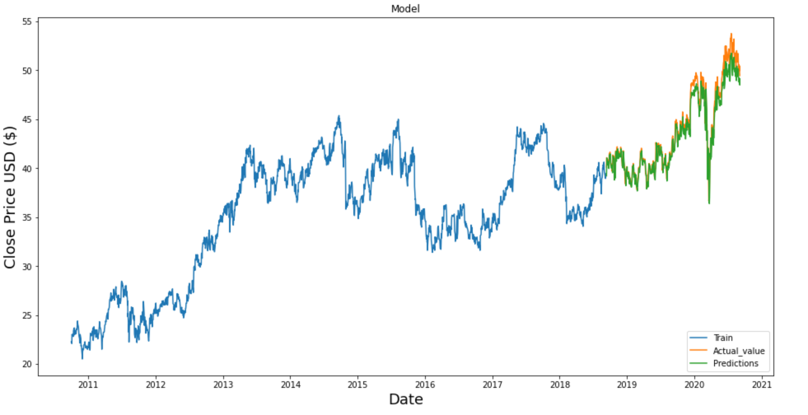
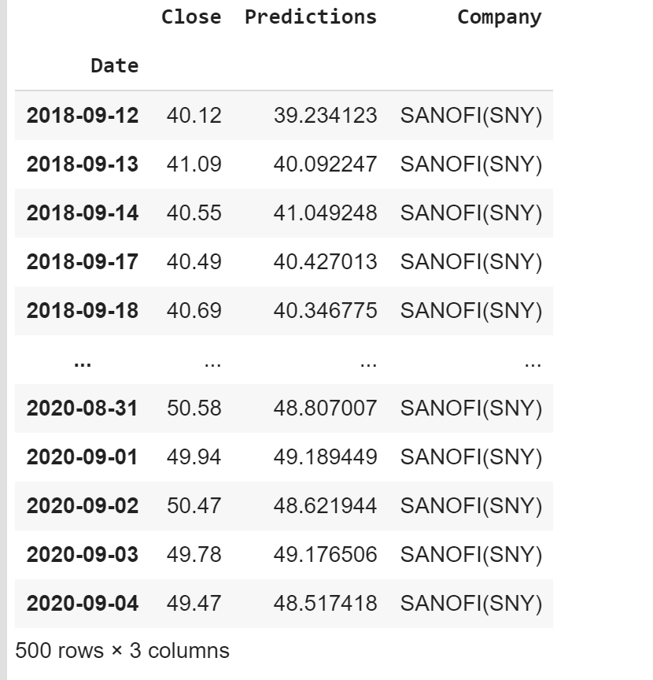

# Trading-Project
Predicting stock prices with LSTM network - Web application(Streamlit)

The goal of this project is to predict with the model LSTM the closing stock price of a corporation SANOFI using the the past 10 years. 

**Long short-term memory (LSTM)** is an artificial recurrent neural network (RNN) architecture used in the field of deep learning.

# Step
In this repository, you will find the following notebook:
1. data vexploration : the history of the stock market data for SANOFI within the last 10 years. I got the data from Yahoo's Finance API. 
2.  Import dataframe Mongodb
3. Noramlization the data with MinMaxScaler
4. Splitting Data into a Training set/ validate  and a Test set 

# LSTM Single Company
A LSTM model used to predict the closing price of a single company. 

## RMSE

## Predictions

# Requirement
Keras

Pandas

numpy

scikit-learn

matplotlib
